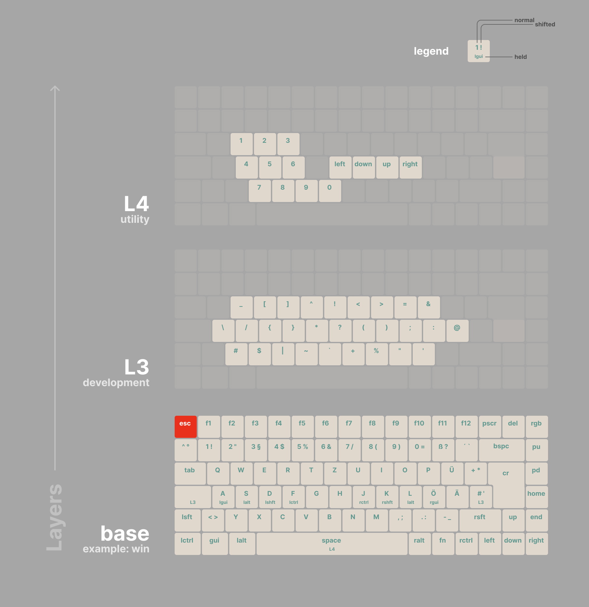

# Keychron K3 Pro Neo Layer 3 QMK Keymap (ISO_DE)

My custom keychron k3 pro ISO_DE qmk firmware.

> Based off this keychron qmk fork branch [https://github.com/Keychron/qmk_firmware/tree/wls_2025q1](https://github.com/Keychron/qmk_firmware/tree/wls_2025q1), as instructed by keychron's lokher on [this comment](https://github.com/Keychron/qmk_firmware/issues/368#issuecomment-2767824519).

#### Prerequisites:

- The keymaps are built for ISO keyboard layout using DE keyboard layout in your OS.
- Basic knowledge of QMK. [https://docs.qmk.fm/](https://docs.qmk.fm/)
- QMK Toolkit and necessary drivers for flashing installed

## The layers

This qmk setup builds on multiple layers to provide better ergonomics for my daily use. These layers are accessible through holding certain keys in the base layers for both mac and windows.

> Note: Blank keys just send whatever keycode on the layer below.



### L3: Development Symbols

This layer provides easy and ergonomic access to symbols commonly used for software development like braces, which are typically extremely annoying to reach on ISO DE layouts.

Holding `L3` (the capslock key) will change into the layer L3 for as long as the key is pressed.

The right `L3` uses `layer_tap` so that it will output `#` if tapped but switches to `L3` when held.

### L4: Utility

This layer provides numpad-like access to numbers on the left hand, and arrow keys on the right hand. The right hand side matches basic vim motions just because I'm used to it.

Holding the `space` key will change into the layer L4 for as long as `space` is pressed.

### Gaming Layer

On Windows: Pressing `KC_PSCR` (print screen) will change into a basic gaming layer, without any of the features or extra layers enabled.

## Features

### Layer Lighting

Depending on the currently active layer, a different rgb background color is used.

- Windows: Blue
- Gaming: Red
- Mac: Green
- L3: Orange
- L4: Pink

### Home Row Mods

Holding home row keys will trigger modifiers.

- `A S D F` | `J K L Ö`
- `GUI ALT SHIFT CTRL` | `CTRL SHIFT ALT GUI`

### CAPS_WORD

Pressing `LSFT` and `RSFT` at the same time will enable "caps word" mode. For the next ["word"](https://stackoverflow.com/a/22931259), everything will be in caps and pressing any key except `a-z` or `-` will end "caps word" mode. This makes writing SNAKE_CASE like `MY_CONSTANT` very easy, especially since I no longer have a CAPSLOCK key.

Pressing `-` will automatically output a `_` character.

### Key Repeat

Sometimes you might want to hold down a key to repeatedly send the same keycode. Like holding down `J` to move down in neovim. For keys with hold functionality you have to double tap, and hold on the second press to get key-repeat behavior as usual. Example: `J > J (hold)`.

## Compile

The qmk firmware has to be built and then flashed manually.

So compile first.

```bash
qmk compile -kb keychron/k3_pro/iso/rgb -km kitsunekyo
```

Then flash with QMK Toolbox

Open the compiled file at `~/qmk_firmware/keychron_k3_pro_iso_rgb_kitsunekyo.bin`. Connect the keyboard in bootloader mode by unplugging it, holding the ESC key while plugging in and letting go of esc after keyboard is connected.

## General info about Keychron K3 Pro QMK Support

While Keychron love to market their keyboards as QMK supported, you have to manually build the firmware from their weird fork, that isnt really up to date with the latest official qmk version.

To add to the confusion, their fork is not using the `master` branch but (depending on your keyboard) either `bluetooth_playground` or `wireless_playground`. From what I've read, `bluetooth_` is for K Pro and Q Pro Bluetooth, and `wireless_` for Max Series. [see github issue...](https://github.com/Keychron/qmk_firmware/issues/217#issuecomment-1899558528)

I installed the prerequisites and ran this

```bash
git clone https://github.com/Keychron/qmk_firmware.git
cd qmk_firmware
git checkout bluetooth_playground # or their new branch `wls_2025q1`
make git-submodule # remember to rerun this when changing to their `wls_2025q1` branch
```

After that, I could continue with the guide [https://docs.qmk.fm/newbs_building_firmware](https://docs.qmk.fm/newbs_building_firmware)

Configure build environment defaults

```bash
qmk config user.keyboard=keychron/k3_pro/iso/rgb
qmk config user.keymap=<github_username>
```

Create a new keymap

```bash
# creates a new keymap with your github_username in keychron/k3_pro/iso/rgb/keymaps
qmk new-keymap
```

## Inspiration

- [neo keyboard layout](https://neo-layout.org/Layouts/neoqwertz/#die-ebenen)
