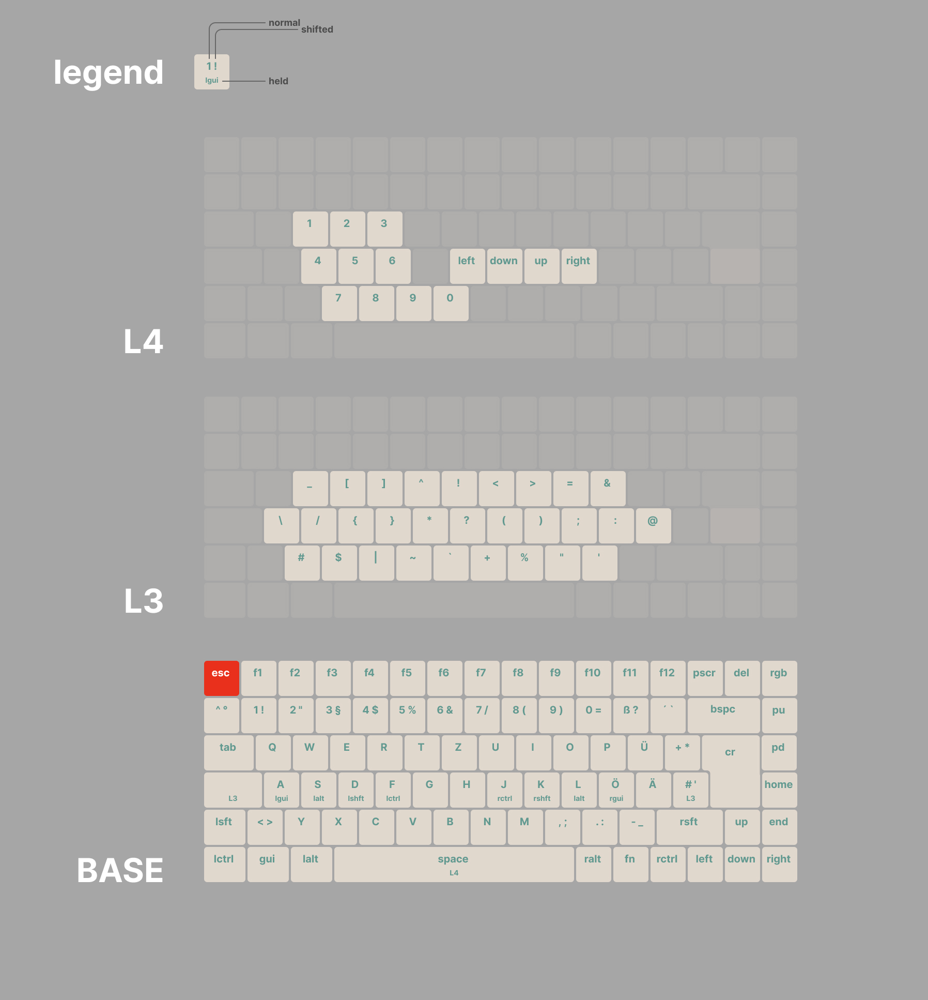

# Keychron K3 Pro Neo Layer 3 QMK Keymap (DE)

Reference the official guide on [https://docs.qmk.fm/](https://docs.qmk.fm/) to learn how to use qmk.

> Note: The keymaps assume you use a DE_ISO keyboard and a DE keyboard layout in your OS.

## Features

### Neo's Layer 3

The [neo keyboard layout](https://neo-layout.org/Layouts/neoqwertz/#die-ebenen) has an amazing layer 3. Installing it on multiple OS sucks though.
This QMK keymap implements a variation of neo layer 3 to have easy access to special characters for software development.

Hold `Mod3` or `M3` to access common dev symbols as shown below.



> Note: Blank keys just send whatever keycode is below layer_3.

The right `M3` uses `layer_tap`, so that it will output `KC_BSLS` as per default if tapped but switches to layer 3 when held.

**Changes to neo's layer 3**

- `;` was moved to the `KC_L` position for easier access

### Caps Word

Pressing `left_shift` and `right_shift` at the same time will enable "caps word" mode. For the next word, everything will be in caps. So you can easily write `MY_CONSTANT` without jumping between modifiers, and having to hold shift.

Typing `-` will automatically output a `_` character.

> Customize which characters delimit a word or are automatically shifted in `caps_word_press_user`.

## Building the firmware for K3 Pro

Keychron isnt great when it comes to QMK support. While they love to market their keyboards as QMK supported, you have to manually build the firmware from their fork.

To add to the confusion, their fork is not using the `master` branch but (depending on your keyboard) either `bluetooth_playground` or `wireless_playground`. From what I've read, `bluetooth_` is for K Pro and Q Pro Bluetooth, and `wireless_` for Max Series. [see github issue...](https://github.com/Keychron/qmk_firmware/issues/217#issuecomment-1899558528)

I installed the prerequisites and ran this

```bash
git clone https://github.com/Keychron/qmk_firmware.git
cd qmk_firmware
git checkout bluetooth_playground
make git-submodule
```

After that, I could continue with the guide [https://docs.qmk.fm/newbs_building_firmware](https://docs.qmk.fm/newbs_building_firmware)

Configure build environment defaults

```bash
qmk config user.keyboard=keychron/k3_pro/iso/rgb
qmk config user.keymap=<github_username>
```

Create a new keymap

```bash
# creates a new keymap with your github_username in keychron/k3_pro/iso/rgb/keymaps
qmk new-keymap
```

Compile

```bash
qmk compile -kb keychron/k3_pro/iso/rgb -km kitsunekyo
```

Then flash with QMK Toolbox

Open the compiled file at `\\wsl.localhost\Ubuntu\home\aspieslechner\qmk_firmware\keychron_k3_pro_iso_rgb_kitsunekyo.bin`. Connect the keyboard in bootloader mode by unplugging it, holding the ESC key while plugging in and letting go of esc after keyboard is connected.